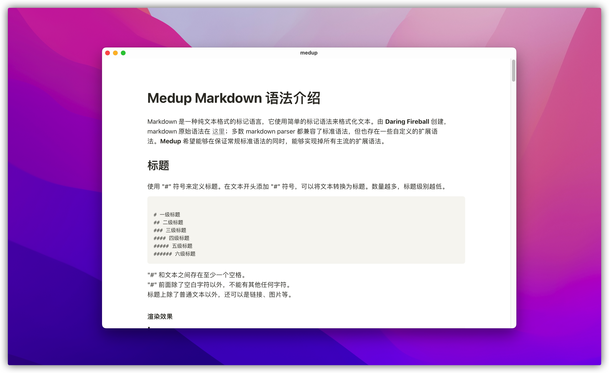

# Medup is a markdown parser and reader!


## Features
* [x] Support all standard syntax of markdown
* [x] Supports all major extension syntaxes
* [x] Provide **library** parsing markdown to html or free custom development based on AST directly
* [x] Provide **CLI** tools to parse markdown to html
* [x] Provide **web service** to host and parse markdown files, and create private document system or blog
* [x] Support css theme selection
* [ ] Support git as storage backend

## Demo



## Usage
```
A markdown parser and reader

Usage: medup <COMMAND>

Commands:
  gen    Generate html from markdown
  serve  Provide an http service for markdown parsing
  help   Print this message or the help of the given subcommand(s)

Options:
  -h, --help     Print help information
  -V, --version  Print version information
```

### CLI

Use the following command to generate a html file from your markdown file.
```
cargo run -- gen --output markdown-guide.html docs/markdown-guide.md
```

### Web 

Use the following command to start an http service on port 8181.
```
cargo run -- serve --config-path themes/notion/config.json --dir docs --static-dir themes
```
or 

```
docker run -d --rm -p 8181:8181 skoowoo/medup:0.1
```

Open `http://localhost:8181` with your browser.
